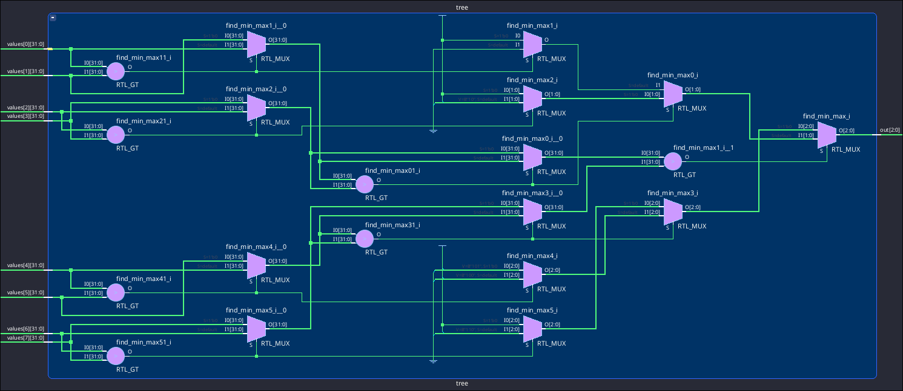

# Hippomenes Tree
A synthesizeable arbitration tree intended for the [Hippomenes](https://github.com/perlindgren/hippomenes) NCLIC interrupt controller.

The tree takes an array of signals and returns the *index* of the smallest/largest value. If only the actual underlying value is of interest, one could remove the index tracking, slightly improving the design, however for our use-case this is out of scope.

## Synthesis Results

A schematic of the elaborated design confirms the tree-like structure.



Figures TBD.

## Try it out
The bundled `arbitration-tree.tcl` can build a ready-to-flash example project, assuming an AMD Artix 7 35T Arty FPGA Evaluation Kit.

Run 
```
vivado -mode tcl -source arbitration-tree.tcl
```
in the root of this repo to generate the Vivado project.

The `hdl/tree.sv` file contains the bulk of the actual business logic. It also defines a couple of parameters to make the tree configurable


